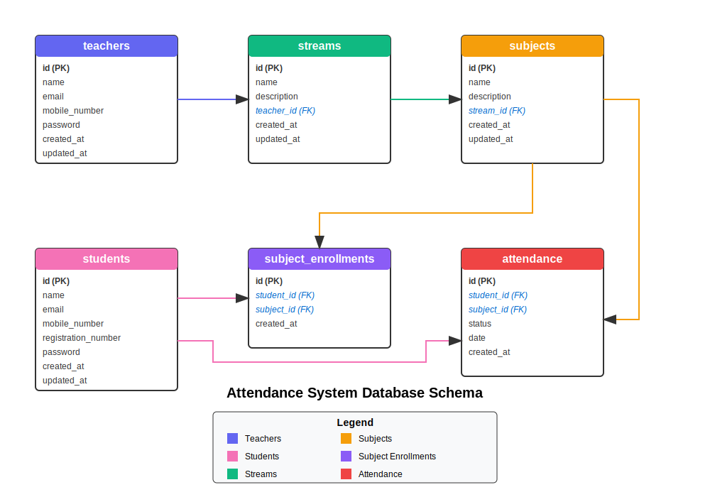

# Attendance System

<div align="center">
  
  <h3>A comprehensive attendance management system</h3>
  <p>Developed by <a href="https://github.com/elsesourav"><strong>SouravBarui</strong></a></p>

[](LICENSE)

</div>

## Overview

The Attendance System is a modern web application designed to streamline attendance tracking for educational institutions. Built with Next.js, MySQL, and Shadcn UI, it provides separate interfaces for teachers and students, making attendance management efficient and user-friendly.

## Features

-  **User Authentication**

   -  Separate login for teachers and students
   -  Secure password hashing with bcrypt
   -  Registration functionality for both teachers and students

-  **Teacher Dashboard**

   -  Create and manage streams (departments/courses)
   -  Add subjects within streams
   -  Take attendance with intuitive colored buttons
   -  View attendance records with filtering options
   -  Recent activity tracking

-  **Student Dashboard**

   -  View enrolled subjects
   -  Check attendance records
   -  Filter attendance by date, month, and year

-  **Attendance Management**

   -  Mark students as present, absent, or late
   -  Automatic marking of missed students as absent
   -  Date-based attendance records
   -  Attendance status visualization

-  **Data Relationships**
   -  Cascade deletion for maintaining data integrity
   -  Optimized database schema for performance

## Database Schema

The application uses a relational database with the following structure:

<div align="center">
  
</div>

## Project Highlights

<div align="center">
  <!-- Add your GIFs here -->
  <div style="display: flex; justify-content: space-around; margin-bottom: 20px;">
    <div>
      <h4>Responsive Design</h4>
      <p><em>Add responsive design GIF here</em></p>
    </div>
    <div>
      <h4>Theme Switching</h4>
      <p><em>Add theme switching GIF here</em></p>
    </div>
  </div>
  <div style="display: flex; justify-content: space-around;">
    <div>
      <h4>Attendance Taking</h4>
      <p><em>Add attendance taking GIF here</em></p>
    </div>
    <div>
      <h4>Record Filtering</h4>
      <p><em>Add record filtering GIF here</em></p>
    </div>
  </div>
</div>

## Tech Stack

### Frontend

-  **Next.js 15.3.2** - React framework with server-side rendering
-  **React 19** - UI library
-  **Tailwind CSS** - Utility-first CSS framework
-  **Shadcn UI** - High-quality UI components
-  **React Icons** - Icon library
-  **React Hook Form** - Form validation
-  **Zod** - Schema validation
-  **Next Themes** - Theme management

### Backend

-  **Next.js API Routes** - Serverless API endpoints
-  **MySQL** - Relational database
-  **NextAuth.js** - Authentication
-  **bcrypt** - Password hashing

## Prerequisites

-  Node.js (v18 or higher)
-  MySQL server
-  npm or yarn

## Setup Instructions

### 1. Clone the repository

```bash
git clone <repository-url>
cd attendance-system
```

### 2. Install dependencies

```bash
npm install
# or
yarn install
```

### 3. Configure environment variables

Create a `.env.local` file in the root directory with the following variables:

```
MYSQL_HOST=localhost
MYSQL_USER=root
MYSQL_PASSWORD=your_mysql_password
MYSQL_DATABASE=attendance_system
NEXTAUTH_SECRET=your_nextauth_secret
NEXTAUTH_URL=http://localhost:3000
```

### 4. Initialize the database

```bash
npm run init-db
# or
yarn init-db
```

This will create the database and tables defined in `database.sql`.

### 5. Run the development server

```bash
npm run dev
# or
yarn dev
```

Open [http://localhost:3000](http://localhost:3000) with your browser to see the application.

## Sample Credentials

### Teacher Login

-  Email: teacher1@example.com
-  Password: 1234

### Student Login

-  Email: student1@example.com
-  Password: 1234

## Theme Support

The application supports both light and dark themes:

-  **System Default**: Automatically matches your system preferences
-  **Light Mode**: Clean, bright interface
-  **Dark Mode**: Eye-friendly dark interface

Theme preferences are saved in local storage for a consistent experience.

## Responsive Design

The application is fully responsive and works on:

-  Desktop computers
-  Tablets
-  Mobile phones

Mobile navigation includes a slide-out menu for easy access to all features.

## Development

### Building for production

```bash
npm run build
# or
yarn build
```

### Starting the production server

```bash
npm start
# or
yarn start
```

## License

This project is licensed under the MIT License - see the [LICENSE](LICENSE) file for details.

## Author

© 2025 [SouravBarui](https://github.com/elsesourav)
